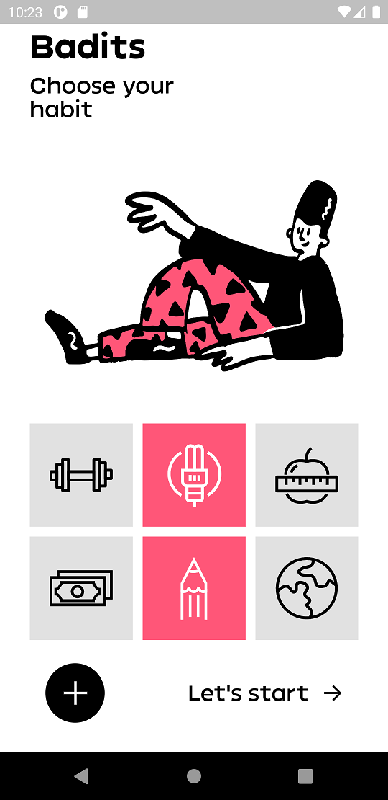

# Badits

## What is it?
A fun little habit reminder app written with the awesome Flutter Framework.

## Why the name?
Glad you asked :smile:

The name consists of the words **bad** and **habits** thus forming **badits**. 

## Screenshots
