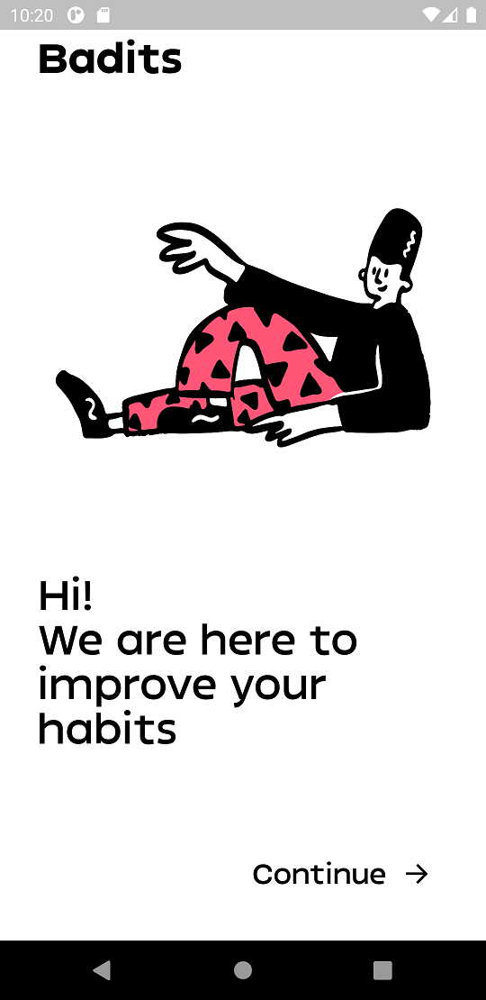
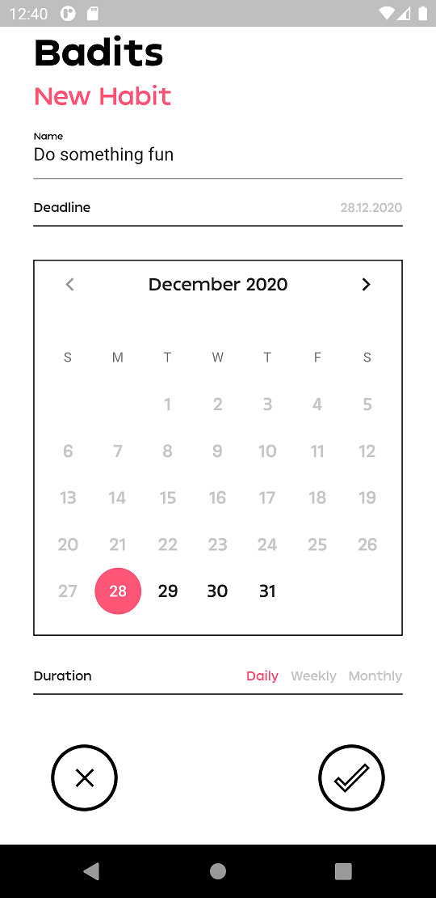
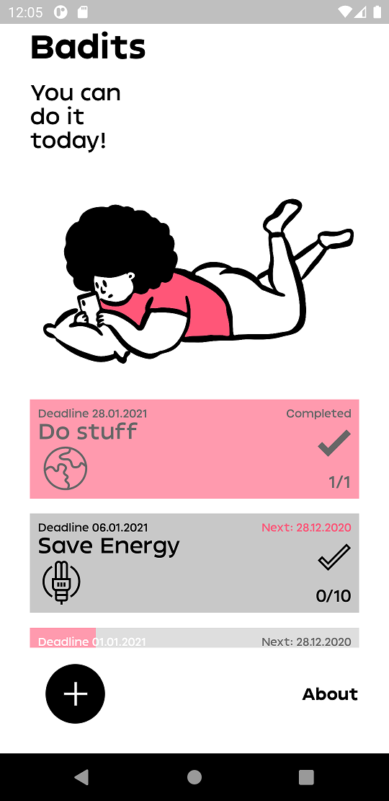
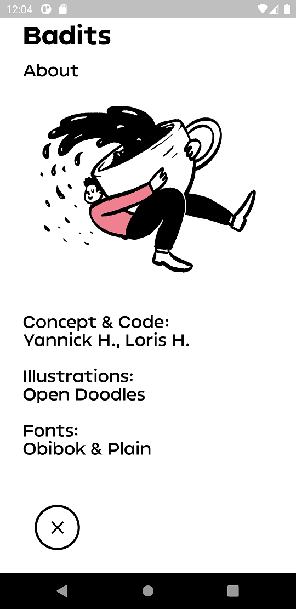

# Badits

## What is it?
A fun little app to get rid of your bad habits (thus the name badits) :smile:.

## How does it work?

### Start Screen
First of all you are greeted with a start screen. This is just a screen which tells you the main purpose of the app which is **to improve your habits**.

### Welcome Screen
After the start screen you are greeted with a welcome screen. Here you can choose one or multiple of the predefined habits by simply tapping on them. You also have the ability to create a habit yourself by clicking on the add button in the lower left corner.

### Create a habit
Here you can create your own habits. A name as well as a deadline is necessary. You can also choose the duration of the habit. The duration determines in which interval the habit should be completed. Let me give you an example. Suppose today is 27th of December and you set the deadline to 31th of December. If you then choose a daily duration that means you have to complete this habit a total of 4 times (each day). On the other hand if you set the deadline to the 27th of Januray with a weekly duration then you have to also complete it 4 times (once a week).

### Dashboard
In the dashboard you can see all your habits. Upon completing the habit for today it gets grayed out and the progress is reflected accordingly.

### About
Just tells you who made this app and which assets etc. were used :smile:.

