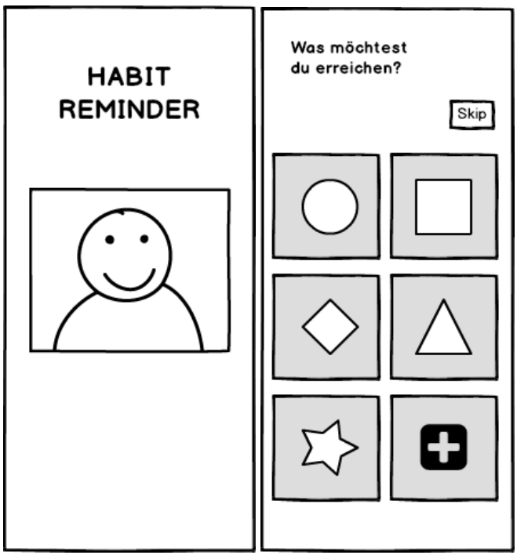

# Badits

## What is it?
A fun little habit reminder app written with the awesome Flutter Framework.

## Why the name?
Glad you asked :smile:

The name consists of the words **bad** and **habits** thus forming **badits**. 

## Screenshots
Here are some of the images of how the final app might look. And do not worry the final look will definitely and improvement over this mockup. Or we could integrate a "Baby" theme...

